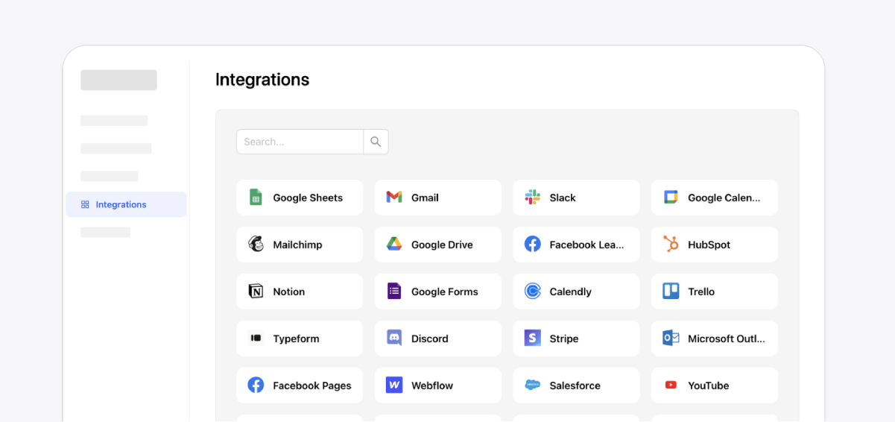

# Integration Widget

The free widget that allows users to explore 6,000+ Zapier integrations right inside your app.

TODO: BADGES

[Quickstart](#quickstart) • [Build Widget](https://get-widget.nepflow.dev/) • [Documentation](https://docs.nepflow.dev/)

## Quickstart

TODO: ABOUT BUILD AND USE CASES

### Use with your existing framework

- React JS: https://github.com/nepflow/react-integration-widget/

## Parameters

TODO: PARAMETERS

## Technical Support or Questions

If you have questions or need help integrating the editor please [contact us](https://nepflow.dev/contact-us) instead of opening an issue.

## License

MIT