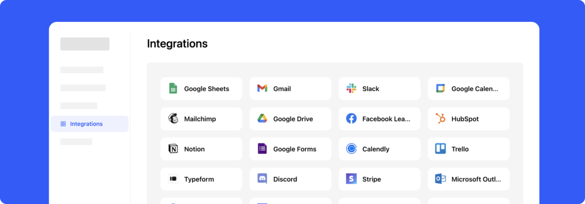

# Integration Widget

Allow users to explore **6,000+ Zapier integrations** right inside your app.

[](https://github.com/nepflow/integration-widget/actions/workflows/production.yaml)


[Installation](#installation) • [Build Widget](https://get-widget.nepflow.dev/) • [Documentation](https://docs.nepflow.dev/)

## Installation

You cxan use [our online builder](https://get-widget.nepflow.dev) to customize the widget and get an installation code.

## JavaScript

For apps that have Zapier integration:

```html
<div id="integration-widget"></div>

<script src="https://widget.nepflow.dev/loader-v1.js"></script>
<script>
  nepflow.init('integration-widget', {
    zapierAppId: '<ZAPIER APP SLUG>',
    backgroundColor: '#ffffff',
    cardColor: '#f5f5f5',
    innerSpace: '24px',
  });
</script>
```

For apps that don't have Zapier integration yet:

```html
<div id="integration-widget"></div>

<script src="https://widget.nepflow.dev/loader-v1.js"></script>
<script>
  nepflow.init('integration-widget', {
    backgroundColor: '#ffffff',
    cardColor: '#f5f5f5',
    innerSpace: '24px',
    onClickService: function(serviceId) {
      alert(serviceId + ' clicked!')
    }
  });
</script>
```

### Or use with your existing framework:

- **React JS**: https://github.com/nepflow/react-integration-widget/

## Parameters

You can pass any of these parameters for your widget:
- **zapierAppId**: Your Zapier app slug.
- **backgroundColor**: The widget's background color.
- **cardColor**: The color for the card components.
- **innerSpace**: The padding inside the widget.
- **verticalAutoResize**: Enables automatic vertical resizing for the iframe.

## Technical Support or Questions

If you have questions or need help integrating the editor please [contact us](https://nepflow.dev/contact-us) instead of opening an issue.

## License

MIT